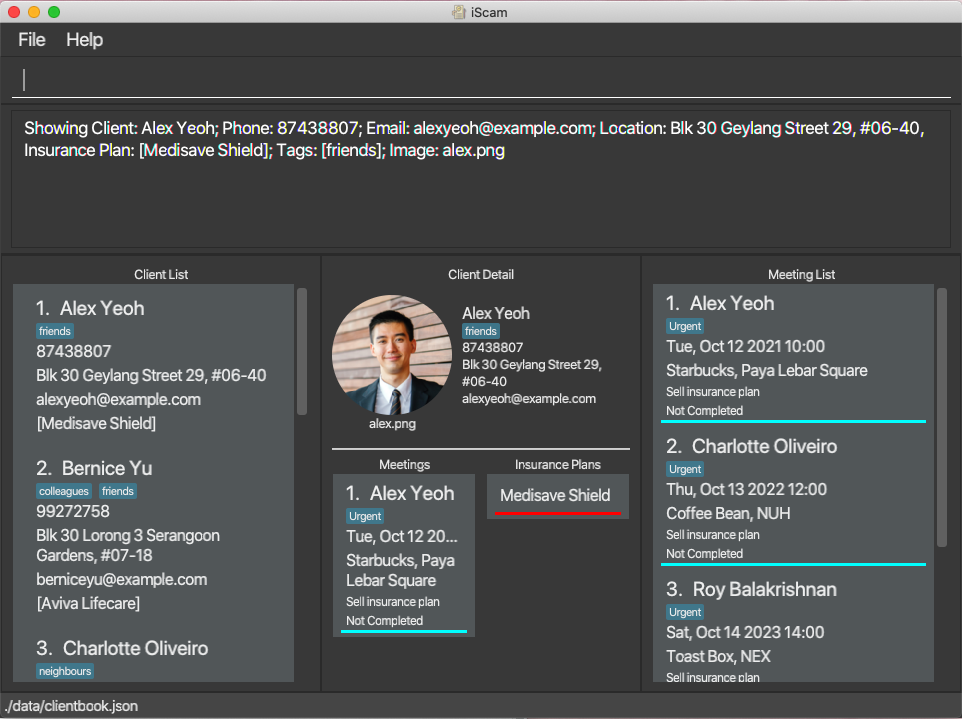

# iSCAM
Welcome to iSCAM, your new client management app. It helps catalogue and manage your clients' information, including upcoming 
appointments with them, and allows you to retrieve these data efficiently. iSCAM also presents your daily scheduled appointments 
in a one-page solution, where you can easily see your schedule for the day.

## For Users
iSCAM can store and manage your client information, such as:
* Name
* Gender
* Age
* Custom Information (e.g. food preferences)
* Appointments you have with them

Client information may be retrieved easily through an efficient search interface, which is optimised for fast-typers too.

Please view the User Guide [here] to see the list of commands you may use with iSCAM.

## For Developers
iSCAM is an ongoing project under the CS2103 Software Engineering module at the National University of Singapore. This project
simulates an ongoing software project build around a desktop application (initially called _AddressBook_) used for managing contact details.
* It is **written in OOP fashion**. It provides a **reasonably well-written** code base **bigger** (around 6 KLoC) than what students usually write in beginner-level SE modules, without being overwhelmingly big.
* It comes with a **reasonable level of user and developer documentation**.

Please view the full Developer Guide [here] for more information.

For detailed documentation of the initial _AddressBook_ project, see the **[Address Book Product Website](https://se-education.org/addressbook-level3)**.

### Acknowledgements
This project is based on the AddressBook-Level3 project created by the [SE-EDU initiative](https://se-education.org).
